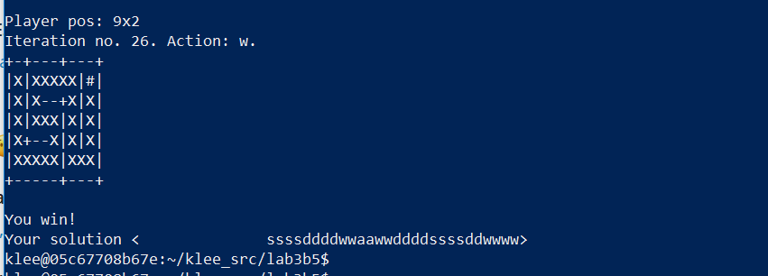
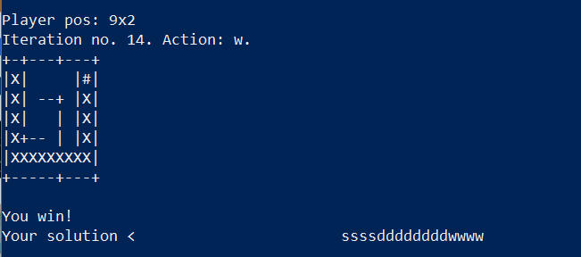
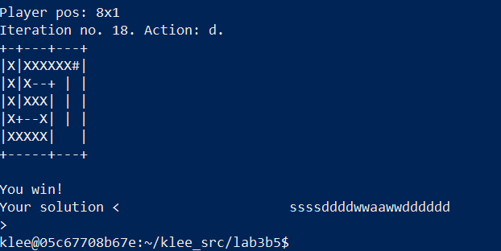
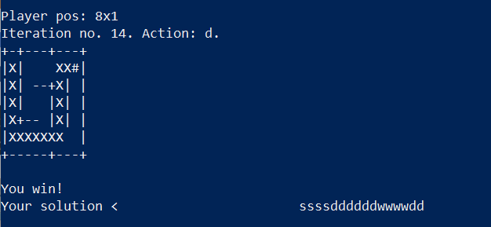
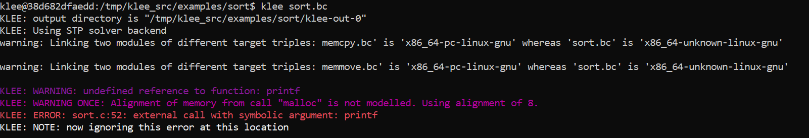
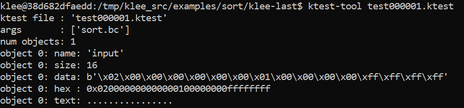
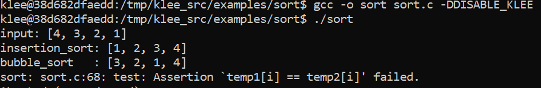
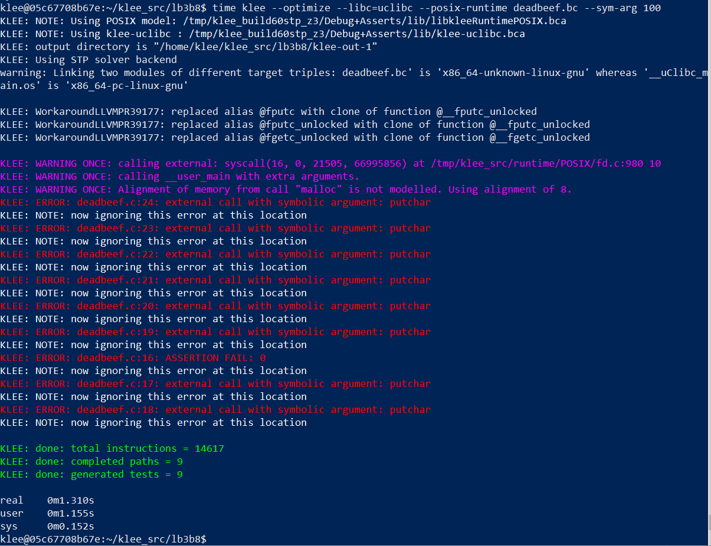

# SLO-Lab03B-AnalyseConcolique

@authors: Dupont Maxime, Mülhauser Florian


## 4. Analyser une Fonction simple


#### Question 4.1

> Que fait l'option `--only-output-states-covering-new` ? Pourquoi l'activer ?

L'option `--only-output-states-covering-new` permet de limiter le nombre de test generations (et donc de test case) au états qui couvrent effectivement des nouvelles instructions. C'est une feature qui permet, surtout dans les grand programmes, d'éviter que beaucoup de test cases  empruntent les même chemins, les calculent et les réexecutent chacun. Ça permet donc d'éviter un gachis de temps et de rendre plus efficient le programme.

On peut voir ça dans le tutorial pour Regexp.bc, Klee est passé par 7438 chemins, mais n'avait besoin d'écrire que 16 test cases, car il en écrit un que pour le premier state qui atteint un bug et les autres sont terminés en silence.


#### Question 4.2


>Que contiennent les fichiers en .ptr.err. Comment les ouvrez-vous ?

Lorsque Klee detect une erreur à l'execution du programme, il génere donc des test cases qui affichent ces bugs. Mais il écrit également des information supplémentaires spécifiques sur l'erreur dans le fichier `testN.TYPE.err`

Le cas du `.ptr.err` indique une erreur de mémoire: un accès (lecture ou ecriture) à des endroits invalides en mémoire

On peut afficher ce fichier en faisant un cat avec son addresse (dans le dossier klee-last).  ex: `cat klee-last/test000009.ptr.err`.

>Que contiennent les fichiers en .ktest. Comment les lisez-vous ?

Les test-case générés et leur informations (valeurs des objects, arguments etc) sont écrit dans les fichiers `.ktest`, nous pouvons lire ces fichiers binaires avec l'utilitaire `ktest-tool`, en executsant la commande: `ktest-tool klee-last/test000009.ktest`


#### Manipulation 4.3

Pour cela on installe vim dans notre docker, on copie colle le fichier. Mais pour utiliser KLEE il faut qu'on le lance avec des entrées symboliques, donc on ajoute un main à ce fichier:

```
#include <assert.h>
#include <stdlib.h>
#include <stdio.h>
#include <klee/klee.h>


int chg_sign(int x, int y) {
        if (x > y){
                x = x + y;
                y = x - y;
                x = x -y; 
                if (x - y > 0)
                        assert(0);
                return x-y;
        }
        return x-y;
} 

int main() {
  int a;
  int b;
  klee_make_symbolic(&a, sizeof(a), "a");
  klee_make_symbolic(&b, sizeof(b), "b");
  return chg_sign(a, b);
}
```

Pour crée chgSign.bc, on utilise ensuite la commande:

`clang -I ../include -emit-llvm -c -g -O0 -Xclang -disable-O0-optnone chgSign.c`

enfin on execute `klee chgSign.bs`


#### Question 4.3

> Que fait la fonction fournie ?

La fonction chg_sign(x, y) var etourner l'opération x-y, en faisant en sort de retourner toujours un résultat négqtif ou nul (il inversera l'opération pour cela):

* Lorsque (x <= y), la fonction retourne x-y, donc un résultat a valeur négative (ou nul)
* Lorsque (x > y), la méthode va donner en plusieurs temps la double affectation (x=y) et (y=x) donc le x aura la valeur initiale de y et inversement.
* * a ce moment la il y a `if(x - y > 0){assert(0);}` Assert(0) sera toujours faux donc une erreur sera lancée si on rentre dans ce if là. Mais ce if ne devrait théoriquement (dans un monde mathématique et non informatique, comme nous allons le voir ensuite) pas arrivé.
* * enfin on retourne x-y, qui est donc la valeur initiale  y-x (l'opération invers pour garantir un résultat negatif ou nul)


#### Question 4.4

> Quel bug est trouvé par KLEE ? Donnez un input permettant d’obtenir ce bug et expliquez ce qui ne va pas dans la fonction.


Comme affiché sur cette capture en rouge, le bug trouvé par klee va etre celui indiqué précedement:

Si on passe cette condition `if(x - y > 0){assert(0);}`, on atteint le assert(0) qui sera forcément faux et donc nous retournera une ASSERTION FAIL .

Pour voir l'input de cette erreur, et vérifier que c'est bien ça (et si c'est la seule erreur), on va voir dans le dossier klee-test les `testN.xxx.err`. Le seul est bien le `test000002.assert.err`. On utilise donc `ktest-tool test000002.ktest` pour avoir plus d'infos:


On remarque que la façon de passer ce if est de créer un underflow. En effet les\ program a input x =1920 et y = -247482527

on a donc bien x > y on rentre dans le premier if. Sauf que lors de l'échange des valeurs, on fait les opérations:

* x = x + y; -> sachant que y est le plus grand int négative, l'opération fait un débordement sur les entier, et au lieu d'avoir un resultat négatif on aura un autre positif.
* y = x - y; -> y = ... et non 1920 comme attendu
* x = x -y;  -> x = .... et non -247482527 comme attendu
* du coup on a bien `if(x - y > 0){assert(0);}` et le assert nous lance l'erreur.


## 5 Labyrinthe

On crée un nouveau folder, avec le fichier maze.c, on y copie colle son code en ajoutant `#include <klee/klee.h>  ` Pour rendre l'input symbolique on remplace le `read(0, program, ITERS);` par `  klee_make_symbolic(program, ITERS, program);`

Afin de pouvoir enregistrer les bonnes solutions, il faut qu'on fasse crasher le programme en cas de victoire, comme ça un rapport et un test sera effectué. Pour cela on ajoute `assert(0);` dans la boucle conditionnelle de la victoire

```
// Source:  http://feliam.wordpress.com/2010/10/07/the-symbolic-maze
/*
It's a maze!
 * Use a,s,d,w to move "through" it.
 */
 
#include<string.h>
#include<stdio.h>
#include<stdlib.h>
#include<klee/klee.h>
 
 
/**
  * Maze hardcoded dimensions
  */
#define H 7
#define W 11
/**
  * Tha maze map
  */
char maze[H][W] = { "+-+---+---+",
                    "| |     |#|",
                    "| | --+ | |",
                    "| |   | | |",
                    "| +-- | | |",
                    "|     |   |",
                    "+-----+---+" };
/**
  * Draw the maze state in the screen!
  */
void draw ()
{
        int i, j;
        for (i = 0; i < H; i++)
          {
                  for (j = 0; j < W; j++)
                                  printf ("%c", maze[i][j]);
                  printf ("\n");
          }
        printf ("\n");
}
 
 
/**
  * The main function
  */
int
main (int argc, char *argv[])
{
        int x, y;     //Player position
        int ox, oy;   //Old player position
        int i = 0;    //Iteration number
    #define ITERS 28
    char program[ITERS];
   
    
 
//Initial position
        x = 1;
        y = 1;
    maze[y][x]='X';
 
//Print some info
    printf ("Maze dimensions: %dx%d\n", W, H);
    printf ("Player pos: %dx%d\n", x, y);
    printf ("Iteration no. %d\n",i);
    printf ("Program the player moves with a sequence of 'w', 's', 'a' and 'd'\n");
    printf ("Try to reach the price(#)!\n");
 
//Draw the maze
    draw ();    
//Read the directions 'program' to execute...
   // read(0,program,ITERS);
    //on transforme en commande symbolique pour KLEE
    klee_make_symbolic(program, ITERS, program);
 
//Iterate and run 'program'
        while(i < ITERS)
          {
          //Save old player position
                  ox = x;
                  oy = y;
          //Move polayer position depending on the actual command
                  switch (program[i])
                    {
                    case 'w':
                            y--;
                            break;
                    case 's':
                            y++;
                            break;
                    case 'a':
                            x--;
                            break;
                    case 'd':
                            x++;
                            break;
                    default:
                        printf("Wrong command!(only w,s,a,d accepted!)\n");
                        printf("You loose!\n");
                        exit(-1);
                    }
 
          //If hit the price, You Win!!            
                  if (maze[y][x] == '#')
                    {
                            printf ("You win!\n");
                            printf ("Your solution <%42s>\n",program);
                            // ici on fait crash le programme en cas de visctoire
                            assert(0);
                            exit (1);
                    }
          //If something is wrong do not advance
                  if (maze[y][x] != ' '
                      &&
                      !(( (y == 5 || ( x == 8 && y == 1) ) && maze[y][x] == '|' && x > 0 && x < W)))
                    {
                            x = ox;
                            y = oy;
                    }
         
          //Print new maze state and info...
          printf ("Player pos: %dx%d\n", x, y);
          printf ("Iteration no. %d. Action: %c. %s\n",i,program[i], ((ox==x && oy==y)?"Blocked!":""));
         
          //If crashed to a wall! Exit, you loose
          if (ox==x && oy==y){
                    printf("You loose\n");
                exit(-2);
          }
          //put the player on the maze...
          maze[y][x]='X';
          //draw it
                  draw ();
          //increment iteration
                  i++;
                  //me wait to human
                  sleep(1);
          }
//You couldn't make it! You loose!       
printf("You loose\n");
}

```

On execute ensuite KLEE, avec l'option `--emit-all-errors`, car cette fois on ne cherche pas juste le bug, mais ce qui importe c'est tout les chemins possibles à ce dernier qu'on a fixé. Donc pour une fois on a besoin de toutes les erreurs pour avoir des rapports de chaques solutions.

`clang -I ../include -emit-llvm -c -g -O0 -Xclang -disable-O0-optnone maze.c` pour créer maze.bc

suivi de `klee --emit-all-errors maze.bc `

#### Question 5.1

> Listez tous les chemins gagnants trouvés par KLEE. Expliquez pourquoi chacun de ces chemins est gagnant en vous référant au code.

Suivant notre marche a suivre, nous découvrons qu'il y a 213 test, mais tous ne sont pas des erreurs (et donc des chemins gagnants).


On fait donc un grep: (on note que nos erreurs sont des .external.err et non des assertions.err. C'est du au fait qu'on a oublié d'importer assert, mais le résultat est le meme).


pour voir les solutions nous allons ouvrire les ktest de ces tests en question:

##### Solution attendue

* ssssddddwwaawwddddssssddwwww



Il s'agit de la solution standard attendue.


##### Solutions dûes à une mauvaise implémentation

Dans le `maze[y][x] ! = [..]`qui code le terrain (et les murs), il y a une mauvaise condition:

 `&& !(( (y == 5 || ( x == 8 && y == 1) )` 

ça explique qu'aucun vrai mur ne peut etre sur la ligne 5, ni sur la case 8x1. On va voir ça en apllication a présent.

* ssssddddddddwwww

Ici on utilise un exploit avec le mur de la ligne 5 qui glitche.



* ssssddddwwaawwdddddd

Ici on utilise un exploit avec le mur de la case 8x1 qui glitche.



* ssssddddddwwwwdd

  Ici on utilise les deux exploit sur les mur qui glitchent (case 8x1 et mur de la ligne 5)



## 6 Keygen avec KLEE

> Modifiez le fichier `keygen.c` afin de pouvoir exécuter KLEE dessus. Faites-en sorte que le programme crashe lorsqu’une solution est trouvée. Lancez KLEE à l’aide de la commande suivante :
> klee --optimize --libc=uclibc --posix-runtime keygen.bc --sym-arg 100

On ajoute:

* `#include <klee/klee.h>`
* `#include <assert.h>`
* `assert(0);` dans le if(v5) final, pour le faire crash quand la solution est trouvée

Ici pas besoin de rajouter des klee_symbolic..., le programme va pouvoir mettre les bonnes inputs directement tout seul.

```
#include <string.h>
#include <stdio.h>
#include <assert.h>
#include <klee/klee.h>

int main(int a1, char **a2, char **a3)
{

  __int64_t v4; // rbx@10
  signed int v5; // [sp+1Ch] [bp-14h]@4

  if ( a1 == 2 )
  {
    if ( 42 * (strlen(a2[1]) + 1) != 504 )
      goto LABEL_31;
    v5 = 1;
    if ( *a2[1] != 69 )
      v5 = 0;
    if ( 2 * a2[1][3] != 202 )
      v5 = 0;
    if ( *a2[1] + 14 != a2[1][6] - 14 )
      v5 = 0;
    v4 = a2[1][5];
    if ( v4 != 9 * strlen(a2[1]) + 6)
      v5 = 0;
    if ( a2[1][1] != a2[1][7]+6 )
      v5 = 0;
    if ( a2[1][1] != a2[1][10] + 5)
      v5 = 0;
    if ( a2[1][1] - 51 != *a2[1] )
      v5 = 0;
    if ( a2[1][3] + 16!= a2[1][9] )
      v5 = 0;
    if ( a2[1][4] != 108 )
      v5 = 0;
    if ( a2[1][2] - a2[1][1] != -8 )
      v5 = 0;
    if ( a2[1][8] - a2[1][7] != -5 )
      v5 = 0;
    if ( v5 ) {
      printf("Launching software!\n");
      assert(0);
    }
    else
LABEL_31:
      printf("Try again...\n");
  }
  else
  {
    printf("Usage: %s <pass>\n", *a2);
  }
}


```

On build keygen.bc

`clang -I ../include -emit-llvm -c -g -O0 -Xclang -disable-O0-optnone keygen.c`

On lance klee avec la commande donnée dans l'ennoncé:

`klee --optimize --libc=uclibc --posix-runtime keygen.bc --sym-arg 100`

#### Question 6.1

> A quoi servent les différentes options passées à KLEE ?

* `--sym-arg 100`: permet de mettre une limite maximale de longueur d'argument a ne pas dépasser. Ainsi nous allons tester que des arguments de taille < 100, sinon ça risqe de jamais ce finir.
* `--posix-runtime`: Cette option permet de modifier les limites de runtime de klee, que ce soit en fixant du temps, ou comme ici en fixant une taille maximale des inputs par la suite. C'est ce qui permet donc l'argument `--sym-arg 100`
* `--libc=uclibc`: pour choisir quelle libc va etre utilisée pour run, ici c'est uclibc, une très petite lib faite pour l'embarqué.
* `--optimize`: Ça fait en sorte d'optimiser le code avant l'exécution, pour obtenir des résultat plus rapidement.

#### Question 6.2

> Quel est le mot de passe permettant de lancer le programme ?

On remarque qu'il n'y a qu'une erreur, c'est bien notre assertion error, donc on a notre mot de passe là. on ouvre le .ktest, et là on trouve le mot de passe `Expeliarmus`.


## Algorithmes de tri (7 pts)

### Question 7.1 (2pts): Que fait la fonction `test()` du fichier `sort.c` ?

> La fonction `test()` regarde si l'insertion_sort et le bubble_sort ont le même résultat, 
cette vérification est effectuée via un assert, donc si le résultat n'est pas le même, alors
la fonction crash.

### Question 7.2 (1pts):


> On peut voir que le problème vient de l'appel à la fonction printf, il s'agit donc d'entourer cet appel 
des lignes 
```c
#ifdef DISABLE_KLEE
#endif
```

### Manipulation 7.2 :
On voit maintenant que l'input posant problème est : 
  
Cependant on peut observer que le problème se détecte aussi avec le tableau input de base {4,3,2,1}.
On observe que le bubble_sort n'est pas terminé et donc que l'assert fail à la fin de l'execution de test.

En étudiant le code, on voit que la boucle du bubble sort ne s'effectue qu'une fois (le tableau n'est parcouru qu'une seule fois).
En effet, puisqu'il n'y a pas de vérification sur notre variable done utilisée comme boolean pour indiquer que le bubble sort est fini, le bubble sort parcourt une fois le tableau, en déplaçant bien sur les nombres, et donc que le 4 est en bonne position mais le tri n'est pas terminé.


### Question 7.3 (4 pts)
Pour corriger ceci, il suffit de rajouter une vérification sur la variable done avant de break :

```c
if(done){
  break;
}
```
(au lieu de la simple ligne break).


## 8 Comparaison avec le Fuzzer


#### Manipulation 8.1

On edite le fichier de base pour rajouter un assert(0) a la place du abort et on met un petit main.

On lance la commande klee avec la commande time devant:

`time klee --optimize --libc=uclibc --posix-runtime deadbeef.bc --sym-arg 100`



Ici on trouve deadbeef (visible avec le assertion fail), en environ 1.3 secondes, ce qui est plus rapide qu'avec AFL

#### Question 8.1

> Que pouvez-vous dire sur les performances de KLEE sur cet exemple par rapport à afl? Pourquoi avons-nous de telles différences ? Justifiez votre réponse.

On s'est documentés avec plusieurs sources, telle que (https://srg.doc.ic.ac.uk/klee18/talks/Zmyslowski-Feeding-the-Fuzzers-with-KLEE.pdf)

AFL utilise un algorithme génétique `genetic algorithms to automatically discover clean, interesting test cases that trigger new internal states in the targeted binary`,c'est donc fort, mais si on ne l'aide pas à se restreindre a une plus petite population initiale il ne va pas etre efficace. Notament sur un problème comme deadbeef (cf slides du lien). Car l'évolution va etre longue et apporter peut d'infos sur un problème un peu random comme ça. Plein de comparatifs nous montre qu'effectivement pour ce problème AFL est bien moins performant pour cette tache que KLEE (de 5 à 10 fois environ selon les versions)

Alors que KLEE a l'avantage d'avoir son système d'optimisation du programme avec le `--optimize` pour effectuer plus rapidement plus de tests, donc pour explorer les chemins comme ici il est bien efficace. De plus deadbeef ne lui pose pas de problème par rapport a ses défauts principaux (path explosion et program-dependant efficacy), vu que c'est un très court programme très léger. Par contre peut etre que pour des problèmes de plus haut niveau, avec des grand programme, KLEE sera moins utile qu'AFL.


