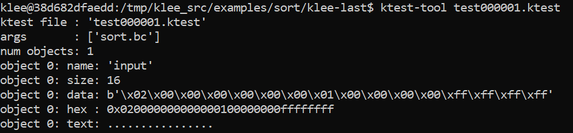
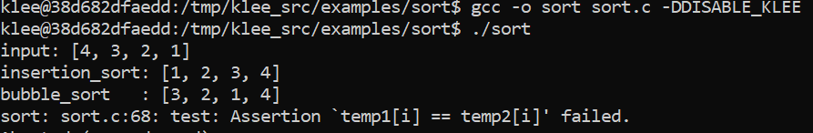

### Algorithmes de tri (7 pts)

##### Question 7.1 (2pts): Que fait la fonction `test()` du fichier `sort.c` ?

> La fonction `test()` regarde si l'insertion_sort et le bubble_sort ont le même résultat, 
cette vérification est effectuée via un assert, donc si le résultat n'est pas le même, alors
la fonction crash.

##### Question 7.2 (1pts):


> On peut voir que le problème vient de l'appel à la fonction printf, il s'agit donc d'entourer cet appel 
des lignes 
```c
#ifdef DISABLE_KLEE
#endif
```

##### Manipulation 7.2 :
On voit maintenant que l'input posant problème est : 
  
Cependant on peut observer que le problème se détecte aussi avec le tableau input de base {4,3,2,1}.
On observe que le bubble_sort n'est pas terminé et donc que l'assert fail à la fin de l'execution de test.

En étudiant le code, on voit que la boucle du bubble sort ne s'effectue qu'une fois (le tableau n'est parcouru qu'une seule fois).
En effet, puisqu'il n'y a pas de vérification sur notre variable done utilisée comme boolean pour indiquer que le bubble sort est fini, le bubble sort parcourt une fois le tableau, en déplaçant bien sur les nombres, et donc que le 4 est en bonne position mais le tri n'est pas terminé.


Pour corriger ceci, il suffit de rajouter une vérification sur la variable done avant de break :

```c
if(done){
	break;
}
```
(au lieu de la simple ligne break).